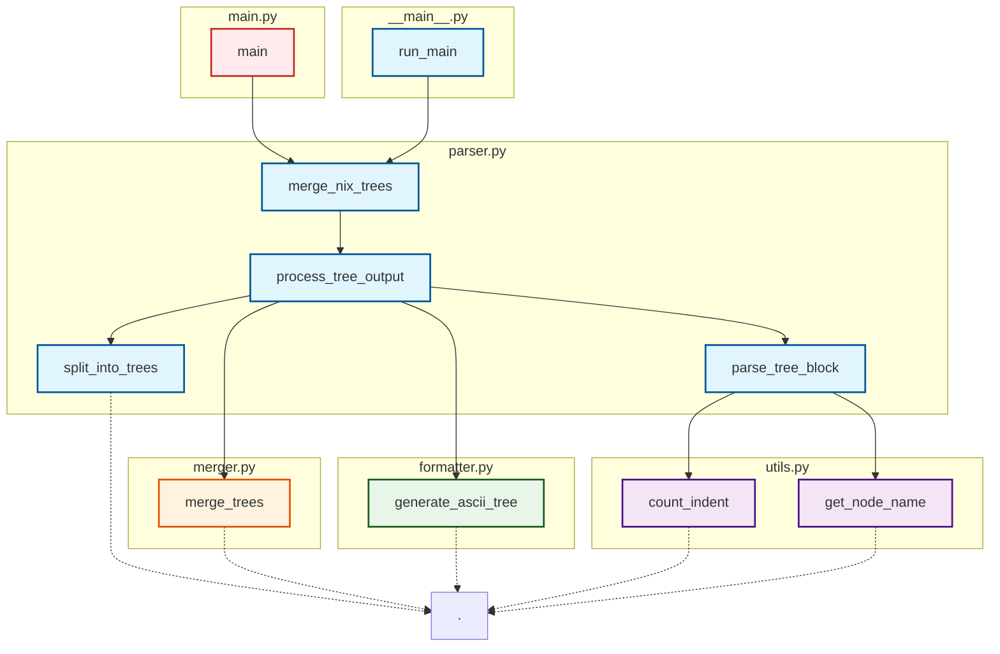

# Tree Parser

A Python library for parsing and merging tree structures from Nix store listings.

## Dependency Tree

Below is a Mermaid diagram showing the dependency relationships between all functions in this project:



## Usage

```python
from tree_parser.parser import merge_nix_trees

input_text = """/nix/store/root
└───/nix/store/child-a
    └───/nix/store/grandchild-a1"""

result = merge_nix_trees(input_text)
print(result['json'])
print(result['ascii'])
```

## Running Tests

```bash
python -m unittest test_complex_tree.py test_merge.py test_parser_wrapper.py
```
