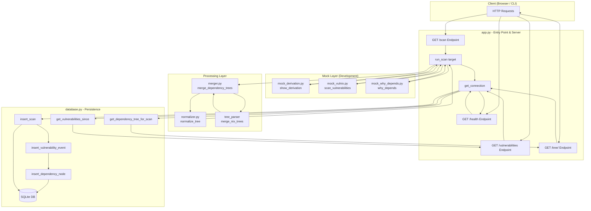
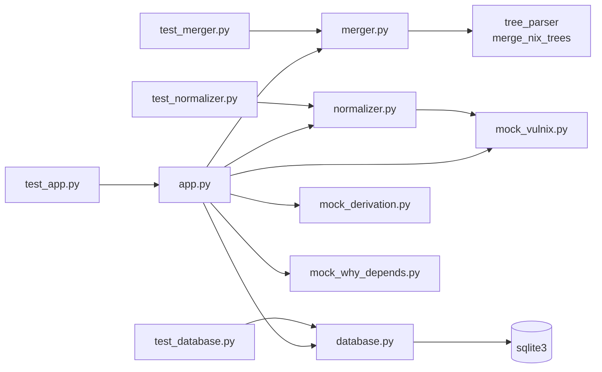

# Vulnerability Scanner - Code Flow Diagram

## High-Level Architecture

```mermaid
graph TB
    subgraph Client ["Client (Browser / CLI)"]
        HTTP[HTTP Requests]
    end

    subgraph AppLayer ["app.py - Entry Point & Server"]
        ScanEP[GET /scan Endpoint]
        VulnEP[GET /vulnerabilities Endpoint]
        TreeEP[GET /tree/<id> Endpoint]
        HealthEP[GET /health Endpoint]
        RunScan[run_scan target]
        GetConn[get_connection]
    end

    subgraph MockLayer ["Mock Layer (Development)"]
        MockDeriv[mock_derivation.py<br/>show_derivation]
        MockVuln[mock_vulnix.py<br/>scan_vulnerabilities]
        MockWhy[mock_why_depends.py<br/>why_depends]
    end

    subgraph ProcessingLayer ["Processing Layer"]
        Merger[merger.py<br/>merge_dependency_trees]
        Normalizer[normalizer.py<br/>normalize_tree]
        TreeParser[tree_parser<br/>merge_nix_trees]
    end

    subgraph StorageLayer ["database.py - Persistence"]
        InsertScan[insert_scan]
        InsertVuln[insert_vulnerability_event]
        InsertNode[insert_dependency_node]
        QueryVuln[get_vulnerabilities_since]
        QueryTree[get_dependency_tree_for_scan]
        DB[(SQLite DB)]
    end

    Client --> HTTP
    HTTP --> ScanEP
    HTTP --> VulnEP
    HTTP --> TreeEP
    HTTP --> HealthEP

    ScanEP --> RunScan
    RunScan --> MockDeriv
    MockDeriv --> RunScan
    RunScan --> MockVuln
    MockVuln --> RunScan
    RunScan --> MockWhy
    MockWhy --> RunScan
    RunScan --> Merger
    Merger --> TreeParser
    TreeParser --> Merger
    Merger --> Normalizer
    Normalizer --> RunScan
    RunScan --> GetConn
    GetConn --> InsertScan
    InsertScan --> InsertVuln
    InsertVuln --> InsertNode
    InsertNode --> DB
    InsertScan --> DB

    VulnEP --> GetConn
    GetConn --> QueryVuln
    QueryVuln --> VulnEP

    TreeEP --> GetConn
    GetConn --> QueryTree
    QueryTree --> TreeEP

    HealthEP --> GetConn
    GetConn --> HealthEP
```

## Data Flow: Scan Pipeline

```mermaid
flowchart LR
    subgraph Input ["Input"]
        Target[/run/current-system/]
    end

    subgraph Derivation ["Derivation Resolution"]
        Show[show_derivation]
        Deriv{"Derivation Dict<br/>/nix/store/...-system.drv"}
    end

    subgraph VulnerabilityScan ["Vulnerability Scan"]
        Scan[scan_vulnerabilities]
        Vulns["Vulnerability List<br/>Diff, ShellCheck"]
    end

    subgraph DependencyMapping ["Dependency Mapping"]
        Why[why_depends]
        Trees["Dependency Trees<br/>Tree A, Tree B"]
    end

    subgraph Merge ["Tree Merger"]
        MergeTrees[merge_dependency_trees]
        TextConv[dict → text]
        TP[tree_parser.merge_nix_trees]
        Merged["Merged Tree<br/>Consolidated"]
    end

    subgraph Normalize ["Normalization"]
        Traverse[traverse_tree]
        Lookup[lookup CVSS scores]
        Classify[classify severity]
        Records["Flat Records<br/>pkg_name, drv_path, severity"]
    end

    subgraph Persist ["Persistence"]
        DBInsert[insert_scan + events + nodes]
        DB[(SQLite)]
    end

    Target --> Show
    Show --> Deriv
    Deriv --> Scan
    Scan --> Vulns
    Vulns --> Why
    Why --> Trees
    Trees --> MergeTrees
    MergeTrees --> TextConv
    TextConv --> TP
    TP --> Merged
    Merged --> Traverse
    Traverse --> Lookup
    Lookup --> Classify
    Classify --> Records
    Records --> DBInsert
    DBInsert --> DB
```

## Module Dependencies

```mermaid
graph LR
    app[app.py] --> merger[merger.py]
    app --> normalizer[normalizer.py]
    app --> database[database.py]
    app --> mock_deriv[mock_derivation.py]
    app --> mock_vuln[mock_vulnix.py]
    app --> mock_why[mock_why_depends.py]

    merger --> tree_parser[tree_parser<br/>merge_nix_trees]

    normalizer --> mock_vuln

    database --> DB[(sqlite3)]

    test_app[test_app.py] --> app
    test_merger[test_merger.py] --> merger
    test_normalizer[test_normalizer.py] --> normalizer
    test_database[test_database.py] --> database
```
