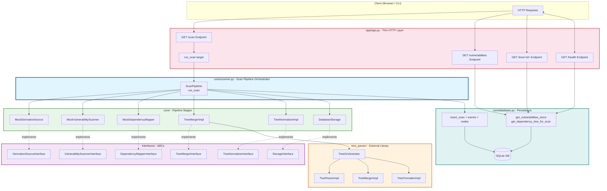
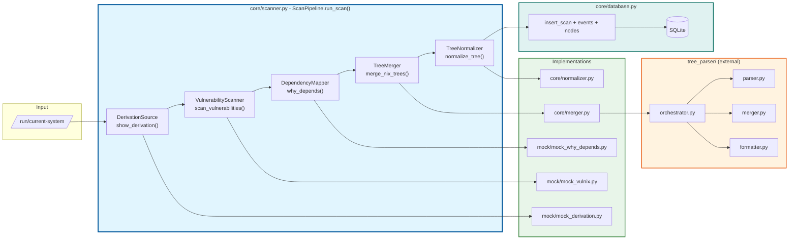
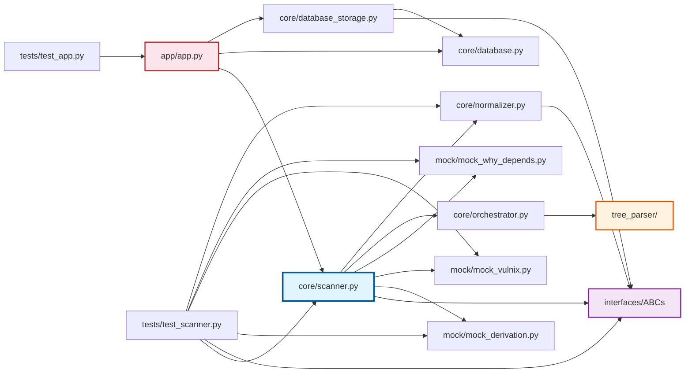

# Vulnerability Scanner - Refactored Code Flow

## High-Level Architecture

```mermaid
graph TB
    subgraph Client ["Client (Browser / CLI)"]
        HTTP[HTTP Requests]
    end

    subgraph HTTPLayer ["app/app.py - Thin HTTP Layer"]
        ScanEP[GET /scan Endpoint]
        VulnEP[GET /vulnerabilities Endpoint]
        TreeEP[GET /tree/&lt;id&gt; Endpoint]
        HealthEP[GET /health Endpoint]
        RunScan[run_scan target]
    end

    subgraph PipelineLayer ["core/scanner.py - Scan Pipeline Orchestrator"]
        ScanPipeline[ScanPipeline<br/>run_scan]
    end

    subgraph StageInterfaces ["interfaces/ - ABCs"]
        DerivInt[DerivationSourceInterface]
        VulnInt[VulnerabilityScannerInterface]
        MapperInt[DependencyMapperInterface]
        MergerInt[TreeMergerInterface]
        NormInt[TreeNormalizerInterface]
        StorInt[StorageInterface]
    end

    subgraph StageImpls ["core/ - Pipeline Stages"]
        DerivSrc[MockDerivationSource]
        VulnScan[MockVulnerabilityScanner]
        DepMap[MockDependencyMapper]
        TreeMerger[TreeMergerImpl]
        TreeNorm[TreeNormalizerImpl]
        DBStorage[DatabaseStorage]
    end

    subgraph TreeParserLib ["tree_parser/ - External Library"]
        Orchestrator[TreeOrchestrator]
        Parser[TreeParserImpl]
        MergerLib[TreeMergerImpl]
        Formatter[TreeFormatterImpl]
    end

    subgraph StorageLayer ["core/database.py - Persistence"]
        DBInsert[insert_scan + events + nodes]
        DBQuery[get_vulnerabilities_since<br/>get_dependency_tree_for_scan]
        DB[(SQLite DB)]
    end

    Client --> HTTP
    HTTP --> ScanEP
    HTTP --> VulnEP
    HTTP --> TreeEP
    HTTP --> HealthEP

    ScanEP --> RunScan
    VulnEP --> DBQuery
    TreeEP --> DBQuery
    HealthEP --> DBQuery

    RunScan --> ScanPipeline
    ScanPipeline --> DerivSrc
    ScanPipeline --> VulnScan
    ScanPipeline --> DepMap
    ScanPipeline --> TreeMerger
    ScanPipeline --> TreeNorm
    ScanPipeline --> DBStorage

    DerivSrc -.implements.-> DerivInt
    VulnScan -.implements.-> VulnInt
    DepMap -.implements.-> MapperInt
    TreeMerger -.implements.-> MergerInt
    TreeNorm -.implements.-> NormInt
    DBStorage -.implements.-> StorInt

    TreeMerger --> Orchestrator
    Orchestrator --> Parser
    Orchestrator --> MergerLib
    Orchestrator --> Formatter

    ScanPipeline --> DBInsert
    DBInsert --> DB
    DBQuery --> DB

    style HTTPLayer fill:#fce4ec,stroke:#c62828,stroke-width:2px
    style PipelineLayer fill:#e1f5fe,stroke:#01579b,stroke-width:3px
    style StageInterfaces fill:#f3e5f5,stroke:#7b1fa2,stroke-width:2px
    style StageImpls fill:#e8f5e9,stroke:#2e7d32,stroke-width:2px
    style TreeParserLib fill:#fff3e0,stroke:#e65100,stroke-width:2px
    style StorageLayer fill:#e0f2f1,stroke:#00695c,stroke-width:2px
```

## Data Flow: Scan Pipeline

```mermaid
flowchart LR
    subgraph Input ["Input"]
        Target[/run/current-system/]
    end

    subgraph Pipeline ["core/scanner.py - ScanPipeline.run_scan()"]
        DerivSrc["DerivationSource<br/>show_derivation()"]
        VulnScan["VulnerabilityScanner<br/>scan_vulnerabilities()"]
        DepMap["DependencyMapper<br/>why_depends()"]
        TreeMerger["TreeMerger<br/>merge_nix_trees()"]
        TreeNorm["TreeNormalizer<br/>normalize_tree()"]
    end

    subgraph Impl ["Implementations"]
        MockDeriv[mock/mock_derivation.py]
        MockVuln[mock/mock_vulnix.py]
        MockWhy[mock/mock_why_depends.py]
        MergerImpl[core/merger.py]
        NormalizerImpl[core/normalizer.py]
    end

    subgraph TP ["tree_parser/ (external)"]
        Orchestrator[orchestrator.py]
        Parser[parser.py]
        MergerLib[merger.py]
        Formatter[formatter.py]
    end

    subgraph Persist ["core/database.py"]
        DBInsert[insert_scan + events + nodes]
        DB[(SQLite)]
    end

    Target --> DerivSrc
    DerivSrc --> VulnScan
    VulnScan --> DepMap
    DepMap --> TreeMerger
    TreeMerger --> TreeNorm
    TreeNorm --> DBInsert
    DBInsert --> DB

    DerivSrc --> MockDeriv
    VulnScan --> MockVuln
    DepMap --> MockWhy
    TreeMerger --> MergerImpl
    MergerImpl --> Orchestrator
    Orchestrator --> Parser
    Orchestrator --> MergerLib
    Orchestrator --> Formatter
    TreeNorm --> NormalizerImpl

    style Pipeline fill:#e1f5fe,stroke:#01579b,stroke-width:3px
    style Impl fill:#e8f5e9,stroke:#2e7d32,stroke-width:2px
    style TP fill:#fff3e0,stroke:#e65100,stroke-width:2px
    style Persist fill:#e0f2f1,stroke:#00695c,stroke-width:2px
```

## Module Dependencies

```mermaid
graph LR
    app[app/app.py] --> scanner[core/scanner.py]
    app --> db_query[core/database.py]
    app --> db_storage[core/database_storage.py]

    scanner --> interfaces[interfaces/ABCs]
    scanner --> mock_deriv[mock/mock_derivation.py]
    scanner --> mock_vuln[mock/mock_vulnix.py]
    scanner --> mock_why[mock/mock_why_depends.py]
    scanner --> orchestrator[core/orchestrator.py]
    scanner --> normalizer[core/normalizer.py]

    orchestrator --> tree_parser[tree_parser/]

    normalizer --> interfaces

    db_storage --> interfaces
    db_storage --> db_query

    test_app[tests/test_app.py] --> app
    test_scanner[tests/test_scanner.py] --> scanner
    test_scanner --> interfaces
    test_scanner --> mock_deriv
    test_scanner --> mock_vuln
    test_scanner --> mock_why
    test_scanner --> normalizer

    style app fill:#fce4ec,stroke:#c62828,stroke-width:2px
    style scanner fill:#e1f5fe,stroke:#01579b,stroke-width:3px
    style interfaces fill:#f3e5f5,stroke:#7b1fa2,stroke-width:2px
    style tree_parser fill:#fff3e0,stroke:#e65100,stroke-width:2px
```
